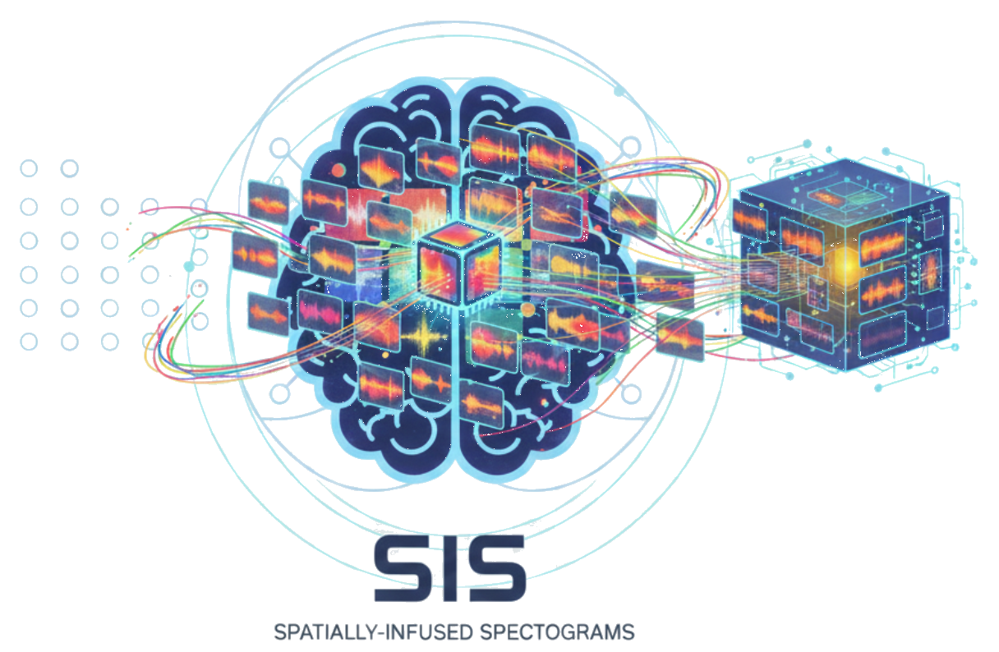

<!-- ===================== HERO SECTION ===================== -->

<h1 align="center">
  SIS-EEG: Spatially-Infused Spectrograms for Robust EEG Feature Extraction in Deep Learning Frameworks
</h1>

  <a href="https://scholar.google.com/citations?user=S6GbuwcAAAAJ&hl=en"><strong>Mohammad Asif</strong></a>,
  <a href="https://nomanali1424.github.io/About/"><strong>Noman Ali</strong></a>,
  <a href="https://www.linkedin.com/in/aditya-gupta-91991215b/"><strong>Aditya Gupta</strong></a>,
  <a href="https://www.linkedin.com/in/diya-srivastava-5a7187160/"><strong>Diya Srivastava</strong></a>,
  <a href="https://scholar.google.com/citations?user=raA5Dc8AAAAJ&hl=en"><strong>Sudhakar Mishra</strong></a>,
  <a href="https://scholar.google.co.in/citations?user=CpLiFv8AAAAJ&hl=en"><strong>Uma Shanker Tiwary</strong></a>

  <em>IEEE International Conference on Acoustics, Speech and Signal Processing (ICASSP), 2026</em>

  
  
  
  

  <!-- Logo placeholder -->
  

  <em>
    Official Demo codebase for 
    <strong>"Spatially-Infused Spectrograms for Robust EEG Feature Extraction in Deep Learning Frameworks"</strong>
  </em>

